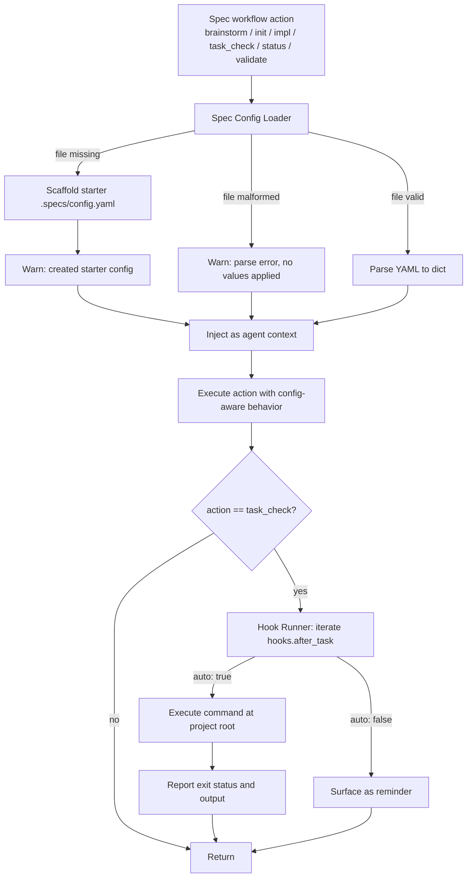

# Specs Config (.specs/config.yaml) Design

Spec: `specs-config`
Status: design-approved
Created: 2026-04-27
Brainstorm: `./brainstorm.md`
Requirements: `./requirements.md`

## Summary

Introduce a single project-wide `.specs/config.yaml` that the spec workflow agent always loads at the start of every spec workflow action (brainstorm, spec init, implementation, task check, status, validate). The file is free-form YAML, parsed once per action and surfaced to the agent as interpreted context that influences subsequent reasoning and output (project goal, tech stack, code principles, post-task hooks). When the file is missing, the agent scaffolds a starter template, warns the user, and continues. When malformed, the agent warns and continues without applying values. Hook entries with `auto: true` are executed by the agent at the appropriate moment (after `spec_task_check`); `auto: false` entries are surfaced as reminders only.

This design treats `config.yaml` as a soft, interpretive contract — not a strict schema — so the agent can adapt to project-specific conventions without code changes, while still enforcing predictable load/scaffold/warn behavior.

## Goals and Non-Goals

### Goals

- Always load `.specs/config.yaml` before every spec workflow action (FR-001, FR-001a, NFR-001).
- Auto-scaffold a starter `.specs/config.yaml` when missing, with a non-blocking warning (FR-002, NFR-002, NFR-004).
- Treat the file as free-form, agent-interpreted YAML with no rigid schema (FR-003).
- Fail soft on malformed YAML: warn and proceed without applying values (FR-004, NFR-001).
- Execute `auto: true` hooks after the relevant action and report their outcome, including failures (FR-005, FR-006, FR-010, NFR-005).
- Surface `auto: false` hooks as reminders only (FR-007).
- Ensure interpreted context (project goal, tech stack, principles) influences brainstorm/requirements/design/tasks/implementation output (FR-008, FR-009).

### Non-Goals

- Per-spec config overrides (`.specs/<slug>/config.yaml`).
- Strict schema validation, required keys, or type enforcement.
- Replacing or rewriting existing spec skill prompts.
- Cross-session caching of config values.
- Implementing config-driven behavior outside the spec workflow agent.

## Architecture

The feature is implemented entirely inside the spec workflow agent layer. There is one new logical module (the **Spec Config Loader**) and one new behavior (the **Hook Runner**) integrated into existing spec workflow entry points.



### Components

1. **Spec Config Loader** — invoked at the start of every spec workflow action.
   - Resolves project root → `.specs/config.yaml`.
   - If absent: writes the starter template, emits a warning, returns an empty dict.
   - If present and parseable: returns the parsed dict.
   - If present and unparseable (or unreadable): emits a warning, returns an empty dict.
   - Always re-reads from disk; no caching across actions.

2. **Context Injector** — takes the loader's dict and surfaces it to the agent's reasoning context for the current action so that interpreted keys (e.g., `project.goal`, `principles.tdd`) influence generated output.

3. **Hook Runner** — invoked after a successful `spec_task_check`. Iterates `hooks.after_task` entries (if any), runs `auto: true` commands at the project root, captures exit status and output, and reports per-hook results. Surfaces `auto: false` entries as reminder messages.

### Integration points

- `spec_brainstorm`, `spec_init`, `spec_status`, `spec_validate`, and the implementation entry path all call the Spec Config Loader as their first step.
- `spec_task_check` calls the Spec Config Loader first, performs the check, then (on success) invokes the Hook Runner.

## Data Model

`.specs/config.yaml` is free-form. The design documents an **illustrative, non-enforced** shape:

```yaml
# .specs/config.yaml — project-wide spec workflow config (free-form, agent-interpreted)

project:
  goal: "Short statement of what this project is for."
  tech_stack:
    - "language/runtime"
    - "framework"
    - "datastore"

principles:
  tdd: false # write tests first when true
  no_comments: false # omit code comments when true
  # add any other principles your team wants the agent to honor

hooks:
  after_task:
    - command: "npm test"
      auto: false # true = agent runs it after each task; false = remind the user
    # - command: "npm run lint"
    #   auto: true
```

### In-memory representation

- Parsed result: a plain `dict` (or empty `dict` on missing/malformed).
- No type coercion beyond what the YAML parser provides.
- Unknown / unexpected keys are preserved and made available to the agent as-is.
- Malformed sub-sections (e.g., `hooks.after_task` not a list) are skipped with a sectional warning; the rest of the dict is still applied.

### Storage

- Single file: `.specs/config.yaml` (project root). No database, no separate state file.
- Created with the same permissions as other `.specs/**` files.

## API / Interface Changes

No external API signatures change. Behavior is additive inside the spec workflow agent.

### Internal entry points (additions)

- `load_spec_config(project_root) -> dict` — implements FR-001..FR-004; always called first by every action.
- `scaffold_spec_config(path) -> None` — writes the starter template (NFR-002); called by the loader on missing file.
- `run_after_task_hooks(config, project_root) -> list[HookResult]` — implements FR-005..FR-007, FR-010, NFR-005; called by `spec_task_check` on success.

### Starter template

The scaffolded file is the YAML block in **Data Model** above, with comments preserved verbatim so the user immediately sees example keys (NFR-002).

### Warning channel

Warnings (missing/malformed/sectional) are emitted on the agent's standard output channel, prefixed with the file path, so they are visible to the user (NFR-004).

### Backwards compatibility

- Projects without `.specs/config.yaml` continue to work; the file is created on first action.
- Projects with `.specs/config.yaml` already present (e.g., from a prior partial implementation) are loaded as-is.
- No existing spec workflow command signatures or outputs change.

## Error Handling

| Failure                                                       | Behavior                                                                                      | Requirement       |
| ------------------------------------------------------------- | --------------------------------------------------------------------------------------------- | ----------------- |
| `.specs/config.yaml` missing                                  | Create `.specs/` if needed, write starter template, warn (path), proceed with empty config.   | FR-002, NFR-001   |
| `.specs/config.yaml` empty (0 bytes)                          | Treat as valid empty dict, no warning, proceed.                                               | Edge case         |
| `.specs/config.yaml` malformed YAML                           | Warn (path + parse error), proceed with empty config.                                         | FR-004, NFR-001   |
| `.specs/config.yaml` unreadable (permissions)                 | Warn (path + IO error), proceed with empty config.                                            | Edge case         |
| Sectional malformation (e.g., `hooks.after_task` is a string) | Warn for that section, ignore that section, apply the rest.                                   | Edge case, FR-003 |
| Hook command not found / non-zero exit                        | Report failed hook (exit code + last output) to user; do not halt the workflow.               | FR-010            |
| Hook command hangs                                            | Reasonable timeout (configurable in implementation); on timeout, kill, report as failed hook. | FR-010            |
| Concurrent task checks                                        | Hooks fire independently per task check; no shared mutable state.                             | Edge case         |

All errors related to config are non-blocking (NFR-001). Errors related to **executed** auto-hooks are surfaced clearly but also non-blocking with respect to the spec workflow itself.

## Security and Privacy

- **Command execution risk.** `auto: true` hooks execute arbitrary shell commands. Mitigation:
  - Commands run from the project root (NFR-005), under the user's existing shell privileges — same trust boundary as the user editing the repo.
  - The starter template ships with `auto: false` examples so users opt into execution explicitly.
  - Hook output is reported back so the user can see exactly what ran.
- **No secrets in config.** The free-form schema is documented as project context, not a secrets store. We do not encourage placing credentials in `.specs/config.yaml`. (No code change required, but the starter template will not include any auth-style examples.)
- **No network calls** introduced by the loader itself. Network behavior is only as a consequence of user-defined hook commands.
- **File permissions.** Scaffolded file uses default repo permissions; no special handling needed.

## Testing Strategy

- **Unit tests (Spec Config Loader):**
  - File missing → starter file created at correct path, warning emitted, returns `{}`.
  - File present + valid YAML → returns parsed dict; arbitrary top-level keys preserved.
  - File present + invalid YAML → warning emitted naming file + error, returns `{}`.
  - File present + zero bytes → returns `{}`, no warning.
  - File present + unreadable (permission denied) → warning emitted, returns `{}`.
  - File re-read on each call (no cross-call cache).
- **Unit tests (Hook Runner):**
  - `hooks.after_task` with `auto: true` → command executed at project root, exit status + output reported.
  - `hooks.after_task` with `auto: false` → no execution, reminder surfaced.
  - `auto: true` command exits non-zero → reported as failed.
  - `auto: true` command not found → reported as failed.
  - Multiple entries → executed in order; each reported independently.
  - Sectional malformation (`hooks.after_task` is a string) → that section skipped with a warning; other config keys still applied.
- **Integration tests (spec workflow actions):**
  - `spec_brainstorm`, `spec_init`, `spec_status`, `spec_validate`, `spec_task_check`, and implementation start each invoke the loader before doing their work.
  - Editing `.specs/config.yaml` between two consecutive actions causes the second action to observe the new values (FR-001a).
  - With `principles.tdd: true`, generated tasks include test-first steps.
  - With `principles.no_comments: true`, generated implementation guidance omits comments.
  - With `project.goal` and `project.tech_stack` set, generated requirements/design/tasks reference that context.
- **End-to-end / manual validation:**
  - Fresh project (no `.specs/`) → first `spec_brainstorm` creates `.specs/` and `.specs/config.yaml` with starter template, warns, proceeds.
  - Hand-corrupt the YAML → next action warns and proceeds without applied values.
  - Configure `hooks.after_task: [{ command: "echo hello", auto: true }]` → after `spec_task_check`, see `hello` reported.
- **Regression coverage:** existing spec workflow tests continue to pass with the loader prepended.

## Rollout and Migration

- **Rollout:** ship as a single update to the spec workflow agent. The first time any user invokes a spec workflow action after the update, the loader runs; if their project lacks the file, the starter template is scaffolded and a warning is emitted (no opt-in needed, no breakage).
- **No data migration** required. Projects with no `.specs/` get one on first action; projects with `.specs/` but no `config.yaml` get the file added.
- **No feature flag.** The behavior is non-blocking by design (NFR-001), so a flag adds risk without value.
- **Rollback:** revert the agent update. Previously scaffolded `.specs/config.yaml` files remain on disk but become inert (the old agent simply ignores them); users may delete them manually if desired.

## Requirements Traceability

| Requirement | Design Decision                                                                                      | Validation                                                                 |
| ----------- | ---------------------------------------------------------------------------------------------------- | -------------------------------------------------------------------------- |
| FR-001      | Spec Config Loader is invoked as the first step of every spec workflow action.                       | Integration tests for each action; assert load call before action body.    |
| FR-001a     | Loader always re-reads from disk; no cross-action cache.                                             | Unit test: edit file between two loads, observe new values.                |
| FR-002      | Loader scaffolds starter template when file missing, then warns and continues.                       | Unit test: missing file → file created, warning emitted, action completes. |
| FR-003      | Loader returns the raw parsed dict; agent interprets keys without schema validation.                 | Unit test: arbitrary top-level keys round-trip into the agent context.     |
| FR-004      | Loader catches parse exceptions, warns, returns empty dict.                                          | Unit test: invalid YAML → warning emitted, empty dict returned.            |
| FR-005      | Hook Runner reads `hooks.after_task` and runs after `spec_task_check` succeeds.                      | Integration test: `spec_task_check` triggers hook iteration.               |
| FR-006      | Hook Runner executes `auto: true` commands at project root, captures exit + output, reports to user. | Unit test for `auto: true` execution; e2e test with `echo`.                |
| FR-007      | Hook Runner surfaces `auto: false` entries as reminders only; no execution.                          | Unit test: `auto: false` → no subprocess; reminder emitted.                |
| FR-008      | Context Injector exposes `project.*` keys to brainstorm/requirements/design/tasks generation.        | Integration test: generated outputs reference configured project context.  |
| FR-009      | Context Injector exposes `principles.*` keys to implementation behavior.                             | Integration test: TDD on → test-first tasks; no_comments on → no comments. |
| FR-010      | Hook Runner reports non-zero exits and missing-binary errors as failed hooks.                        | Unit tests for non-zero exit and missing binary.                           |
| NFR-001     | Loader and Hook Runner are non-blocking on missing/malformed config and on hook failures.            | Test that no exception escapes; action always completes.                   |
| NFR-002     | Starter template is human-readable YAML with inline comments.                                        | Visual / snapshot test of scaffolded file.                                 |
| NFR-003     | Hard-coded path: `.specs/config.yaml`. No alternate locations.                                       | Unit test: loader does not search parent dirs or alternates.               |
| NFR-004     | Warnings emitted on the agent's standard output channel with the file path.                          | Test: capture output, assert path appears in warning.                      |
| NFR-005     | Hook Runner sets `cwd = project_root` when spawning processes.                                       | Unit test: spawned subprocess `cwd` matches project root.                  |

## Risks and Trade-offs

- **Risk: free-form schema → inconsistent agent behavior.** Different teams may use different keys, leading to variability across projects.
  - _Mitigation:_ the starter template seeds a small set of conventional keys (`project.*`, `principles.*`, `hooks.*`) so most users converge.
  - _Alternative considered:_ strict schema with required keys. Rejected because it raises adoption friction and contradicts the "agent interprets" decision from brainstorm.
- **Risk: auto-executing hook commands have side effects.** A misconfigured `auto: true` could run an unwanted command.
  - _Mitigation:_ starter template ships with `auto: false`; hook output is fully reported so misconfigurations are visible immediately; failures are surfaced (FR-010).
  - _Alternative considered:_ mandatory one-time confirmation before any `auto: true` runs. Open question in requirements; left for future enhancement if needed.
- **Risk: scaffolded file goes unnoticed and remains an empty stub.** Users may not edit it.
  - _Mitigation:_ the warning emitted on first creation explicitly names the file and invites the user to fill it in.
- **Risk: re-reading the file on every action has a small I/O cost.** Negligible at expected usage frequencies; explicitly preferred over caching to satisfy FR-001a.
- **Trade-off:** non-blocking on malformed YAML keeps the workflow usable but means a typo silently degrades agent behavior until the user reads the warning. Acceptable per the brainstorm decision (option 2 + 3).
