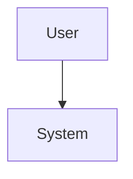

# {{TITLE}} Design

Spec: `{{SLUG}}`  
Status: design-draft  
Created: {{DATE}}  
Brainstorm: `./brainstorm.md`
Requirements: `./requirements.md`

## Summary

TODO: Explain the chosen approach in one or two paragraphs.

## Goals and Non-Goals

### Goals

- TODO: Goal tied to FR/NFR IDs.

### Non-Goals

- TODO: Work intentionally deferred.

## Architecture

TODO: Describe components, modules, boundaries, data flow, and interactions.

## Data Model

TODO: Describe data structures, storage changes, validation rules, and migrations.

## API / Interface Changes

TODO: Describe public APIs, commands, UI flows, events, config, and backwards compatibility.

## Error Handling

TODO: Describe expected failures, recovery behavior, retries, user-facing errors, and logging.

## Security and Privacy

TODO: Describe authorization, data exposure, secrets, auditability, and abuse cases.

## Testing Strategy

- Unit tests: TODO
- Integration tests: TODO
- End-to-end/manual validation: TODO
- Regression coverage: TODO

## Rollout and Migration

TODO: Describe rollout sequence, feature flags, data migrations, and rollback plan.

## Requirements Traceability

| Requirement | Design Decision | Validation |
| ----------- | --------------- | ---------- |
| FR-001      | TODO            | TODO       |
| FR-002      | TODO            | TODO       |
| NFR-001     | TODO            | TODO       |

## Risks and Trade-offs

- TODO: Risk, mitigation, and alternative considered.
